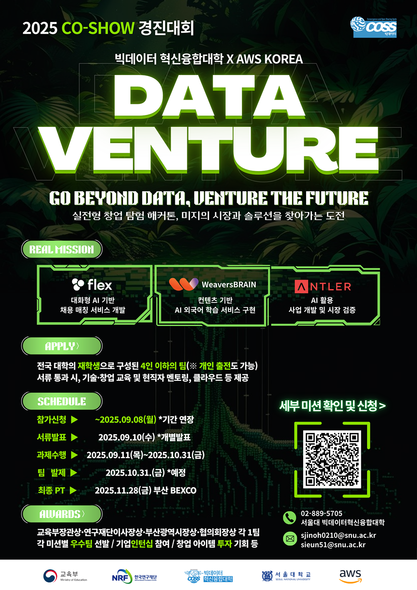
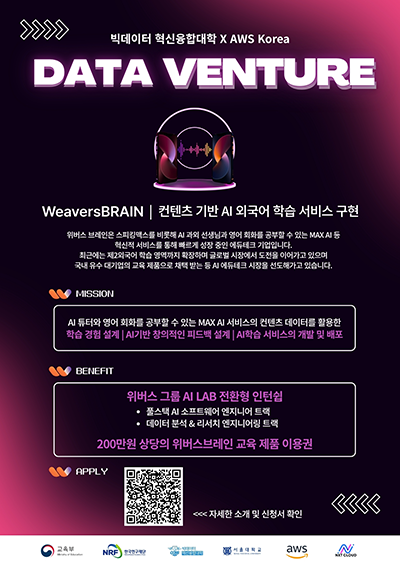

# 🌟 프로젝트 배경: 여정의 시작

우리가 개발한 **숏폼 기반 AI 외국어 학습 서비스 '휙!'**은 단순히 아이디어에서 시작된 것이 아니라, **빅데이터와 클라우드 기술**을 활용하여 실제 산업 문제를 해결하는 데서 출발했습니다.

---

### 1. 🔍 도전의 시작: 2025 DATA VENTURE

본 프로젝트는 서울대학교 빅데이터 혁신융합대학과 **AWS Korea**가 공동 주관한 **'2025 CO-SHOW 경진대회 데이터 벤처'**의 과제에서 시작되었습니다.

경진대회는 **Flex, WeaversBRAIN, ANTLER** 세 기업이 제시한 실질적인 비즈니스 과제를 바탕으로 진행되었으며, 저희 팀은 이 중 **'WeaversBRAIN'** 기업의 미션에 도전하기로 결정했습니다.

 

  

 

---

### 2. 🎯 핵심 목표: 컨텐츠 기반 AI 학습 구현

저희 팀이 선택한 **위버스 브레인(WeaversBRAIN)**의 미션은 다음과 같았습니다.

> **💡 주요 주제: 컨텐츠 기반 AI 외국어 학습 서비스 구현**
>
> 이 과제를 통해 외국어 회화 콘텐츠 기반의 학습 경험을 설계하고, **AI 기반의 창의적 피드백**을 제공하는 혁신적인 서비스 모델을 구축하는 것을 목표로 삼았습니다.

 

  

 

---

### 3. 🏁 최종 검증: 2025 CO-SHOW 발표 및 수상

아이디어 구상과 약 두 달간의 집중적인 개발을 거쳐, 10월 31일 중간 발표를 성공적으로 통과하며 저희 팀은 **최종 발표 자격**을 획득했습니다.

이후, 11월 26일부터 11월 29일까지 부산 BEXCO에서 개최된 **'2025 CO-SHOW'** 무대에서 최종 결과물을 선보였으며, 그 우수성을 인정받아 **두 가지 큰 상**을 수상하며 서비스의 가능성과 기술적 완성도를 완벽하게 입증했습니다.

> **🏆 검증된 성과 (Awards)**
> * **2025 DATA VENTURE (위버스브레인 과제):** **대상 수상** 🥇
> * **2025 CO-SHOW 빅데이터 컨소시엄:** **부산광역시장상 수상** 🏅

 

  

 

이러한 **데이터 기반 도전 과제**를 통해 탄생한 결과물이 바로, 여러분의 외국어 학습을 혁신할 **콘텐츠 기반 AI 외국어 학습 서비스 '휙!'**입니다.

---
