# 🌟 프로젝트 배경: 여정의 시작 (The Origin Story)

우리가 개발한 **숏폼 기반 AI 외국어 학습 서비스 '휙!'**은 단순히 아이디어에서 시작된 것이 아니라, **빅데이터와 클라우드 기술**을 활용하여 실제 산업 문제를 해결하는 데서 출발했습니다.

---

<table>
  <tr>
    <td width="60%" valign="top">
      <h3>1. 도전의 시작: 2025 DATA VENTURE</h3>
      
본 프로젝트는 서울대학교 빅데이터 혁신융합대학과 <b>AWS Korea</b>가 공동 주관한 <b>'2025 CO-SHOW 경진대회 데이터 벤처'</b>의 과제에서 시작되었습니다.

      
경진대회는 <b>Flex, WeaversBRAIN, ANTLER</b> 세 기업이 제시한 실질적인 비즈니스 과제를 바탕으로 진행되었으며, 저희 팀은 이 중 <b>'WeaversBRAIN'</b> 기업의 미션에 도전하기로 결정했습니다.

    </td>
    <td width="40%" align="center">
      
    </td>
  </tr>

  <tr>
    <td width="60%" valign="top">
       
      <h3>2. 핵심 목표: 컨텐츠 기반 AI 학습 구현</h3>
      
저희 팀이 선택한 <b>위버스 브레인(WeaversBRAIN)</b>의 미션은 다음과 같았습니다.

      <blockquote>
        
<b>💡 주요 주제: 컨텐츠 기반 AI 외국어 학습 서비스 구현</b>

        
이 과제를 통해 외국어 회화 콘텐츠 기반의 학습 경험을 설계하고, <b>AI 기반의 창의적 피드백</b>을 제공하는 혁신적인 서비스 모델을 구축하는 것을 목표로 삼았습니다.

      </blockquote>
    </td>
    <td width="40%" align="center">
       
      
    </td>
  </tr>

  <tr>
    <td width="60%" valign="top">
       
      <h3>3. 최종 검증: 2025 CO-SHOW 발표 및 수상</h3>
      
아이디어 구상과 약 두 달간의 집중적인 개발을 거쳐, 10월 31일 중간 발표를 성공적으로 통과하며 저희 팀은 <b>최종 발표 자격</b>을 획득했습니다.

      
이후, 11월 26일부터 11월 29일까지 부산 BEXCO에서 개최된 <b>'2025 CO-SHOW'</b> 무대에서 최종 결과물을 선보였으며, 그 우수성을 인정받아 <b>두 가지 큰 상</b>을 수상하며 서비스의 가능성과 기술적 완성도를 완벽하게 입증했습니다.

      <blockquote>
        
<b>🏆 검증된 성과 (Awards)</b>

        <ul>
          <li><b>2025 DATA VENTURE (위버스브레인 과제):</b> <b>대상 수상</b> 🥇</li>
          <li><b>2025 CO-SHOW 빅데이터 컨소시엄:</b> <b>부산광역시장상 수상</b> 🏅</li>
        </ul>
      </blockquote>
    </td>
    <td width="40%" align="center">
       
      
    </td>
  </tr>
</table>

 

이러한 **치열한 경쟁과 검증 과정**을 통해 탄생한 결과물이 바로, 여러분의 외국어 학습을 혁신할 **콘텐츠 기반 AI 외국어 학습 서비스 '휙!'**입니다.

---

# 🚀 서비스 소개: 휙! 넘기다 보면 말이 트인다!

  <a href="https://hwik.shop" target="_blank" rel="noopener noreferrer" style="text-decoration: none;">
    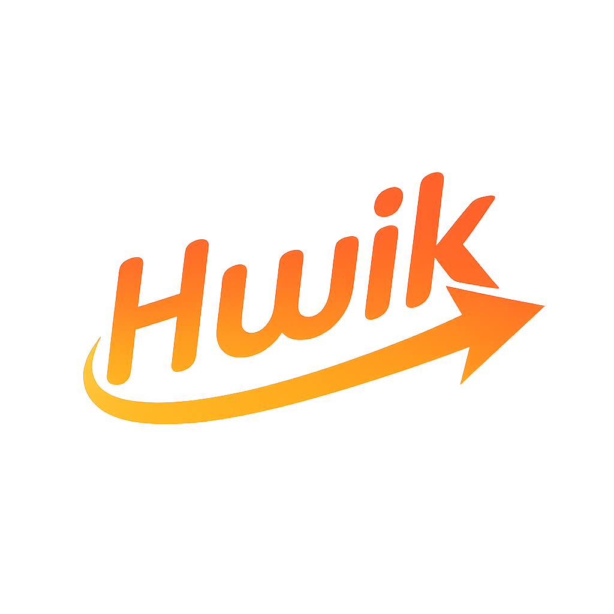
    <h3 style="margin: 10px 0; color: #111;">휙! (Hwik!)</h3>
  </a>
  

    👉 로고를 눌러 휙! 사이트로 이동하세요.
  

### 💡 기획 의도

현대인의 휴식 시간, 버스와 지하철에서의 자투리 시간은 '유튜브 쇼츠'나 '릴스'가 점령했습니다. 우리는 **"사람들이 멍하니 흘려보내는 이 시간을 학습 시간으로 바꿀 수는 없을까?"** 라는 질문에서 출발했습니다.

* **부담 없는 접근:** 공부라는 심리적 장벽을 없애기 위해, 사용자에게 가장 익숙한 **숏폼 UI**를 차용했습니다.

* **강력한 훅(Hook):** "교육용 영상은 지루하다"는 편견을 깨기 위해, 에듀테크 관점에서 **몰입감 높고 흥미로운 시나리오의 숏폼 콘텐츠**를 직접 제작하여 학습 지속성을 확보했습니다.

---

### 📚 학습 방법: 4단계 PPP 순환 학습 (Flow Learning)

검증된 언어 학습 이론인 **PPP (Presentation - Practice - Production)** 모델을 숏폼 환경에 최적화하여 설계했습니다.

<table width="100%">
  <thead>
    <tr>
      <th width="50%" align="center">Step 1. 상황 이해하기 (Context)</th>
      <th width="50%" align="center">Step 2. 문장 재배치 (Structure)</th>
    </tr>
  </thead>
  <tbody>
    <tr>
      <td align="center" valign="top">
        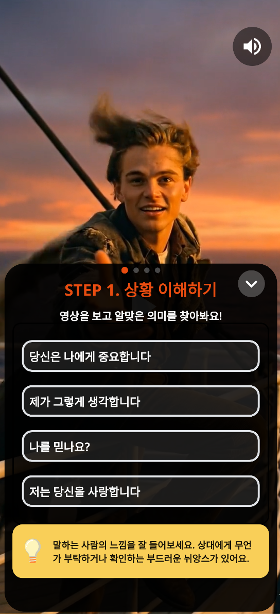
          
        <b>"영상 속 주인공이 되어 상황에 몰입합니다."</b> 
        살아있는 <b>맥락(Context)</b> 속에서 핵심 표현과 뉘앙스를 자연스럽게 파악합니다.
      </td>
      <td align="center" valign="top">
        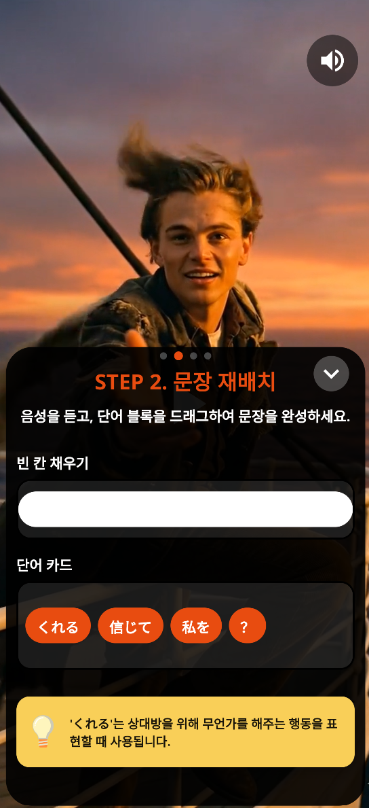
          
        <b>"흩어진 문장을 재배열하며 구조를 익힙니다."</b> 
        단어 블록을 조립하며 문장의 <b>구조적 원리</b>를 게임을 하듯 능동적으로 체득합니다.
      </td>
    </tr>
  </tbody>
</table>

<table width="100%">
  <thead>
    <tr>
      <th width="50%" align="center">Step 3. 따라 말하기 (Shadowing)</th>
      <th width="50%" align="center">Step 4. 이제 당신 차례 (Role-Play)</th>
    </tr>
  </thead>
  <tbody>
    <tr>
      <td align="center" valign="top">
        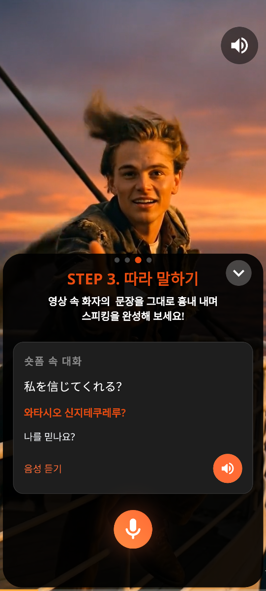
        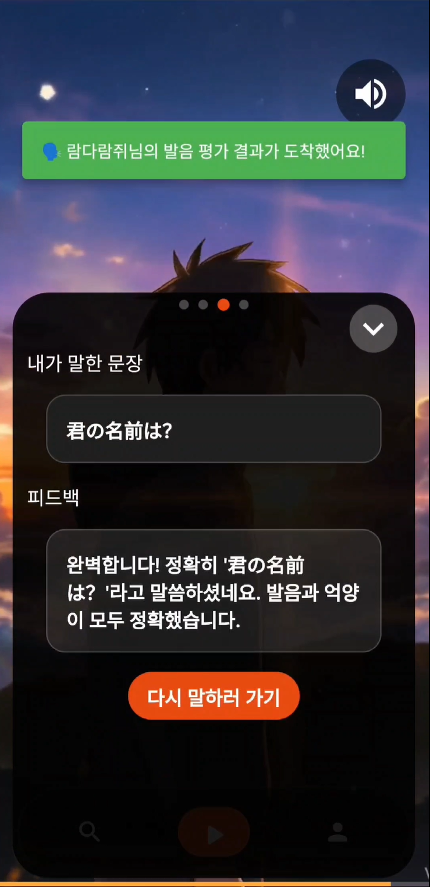
          
        <b>"주인공의 억양과 발음을 그대로 훔칩니다."</b> 
        AI가 사용자의 발음을 분석하여 <b>정확도(Accuracy)</b>와 <b>억양</b>을 즉시 피드백합니다.
      </td>
      <td align="center" valign="top">
        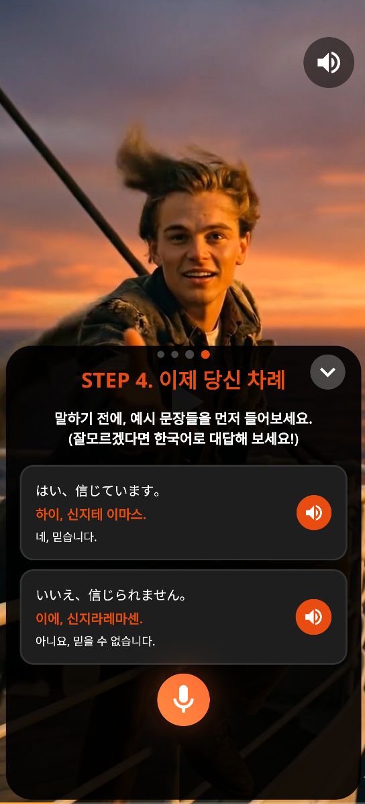
        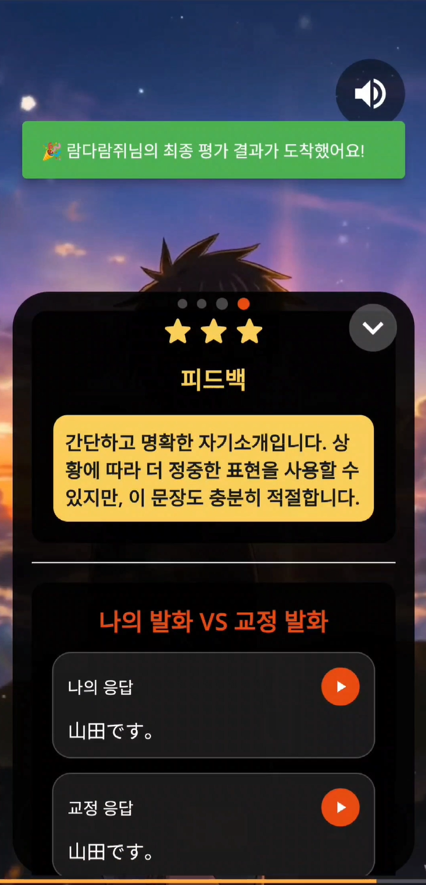
          
        <b>"다음 대사를 상상하여 대화를 완성합니다."</b> 
        상호작용하는 <b>프리 토킹</b>을 통해 실전 회화 감각을 극대화하며 발화 이후 피드백을 통해 더욱 정확하고 완성도 높은 표현력을 갖춥니다.
      </td>
    </tr>
  </tbody>
</table>

 

---
# 🛠️ 아키텍쳐 및 기술스택

### 1. 시스템 아키텍처

 

  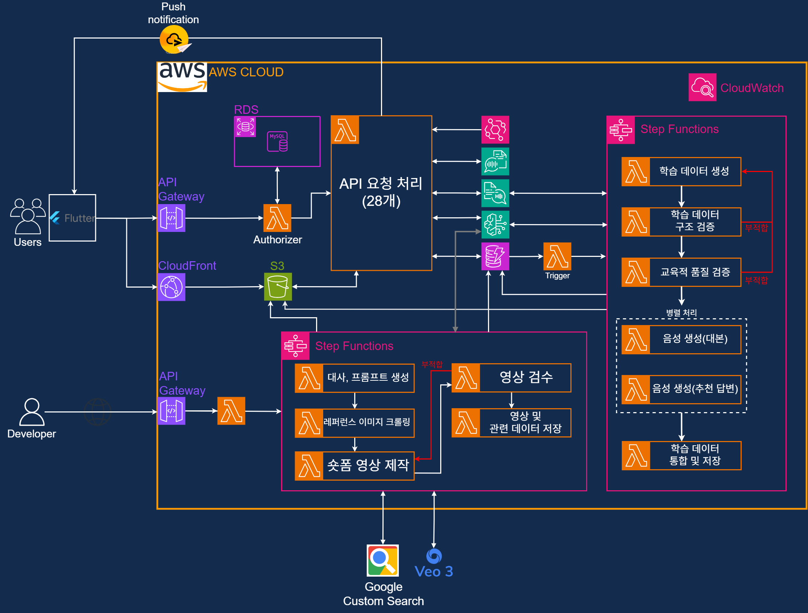

 

### 2. 기술 전략

#### Full Serverless Backend (AWS Lambda + API Gateway)
* **서버리스 전환:** 고정 비용이 발생하는 EC2 대신, **AWS Lambda**와 **API Gateway**를 활용하여 모든 비즈니스 로직을 처리했습니다.
* **API 구성:** 총 **28개의 API Endpoints**를 마이크로서비스 단위로 쪼개어 구현함으로써, 특정 기능의 트래픽이 몰려도 전체 서비스에 영향이 가지 않도록 설계했습니다.

#### Gen-AI Pipeline Automation (Step Functions Workflow)
사용자 이탈을 막기 위해 **"매력적인 숏폼 콘텐츠"**를 지속적으로 공급하는 것이 핵심이었습니다. 이를 위해 **AWS Step Functions**를 활용하여 영상 및 학습 데이터 생성 파이프라인을 자동화했습니다.

* **영상 생성 파이프라인:**
    * **리소스 확보:** `Google Custom Search`로 레퍼런스 이미지를 크롤링하여 **Google Veo 3** 모델이 고품질 영상을 생성하도록 유도했습니다.
    * **품질 검증 (QA):** 각 단계마다 **Lambda 기반의 검수 로직**을 배치하여, 생성된 영상이 교육용으로 적합한지 판단하고 부적합 시 자동으로 재생성하는 루프를 구현했습니다.
* **학습 데이터 생성 파이프라인:**
    * 단순 생성에 그치지 않고, **엄격한 가이드라인**이 적용된 프롬프트를 통해 학습 질문의 교육적 가치를 보장했습니다.

#### Advanced AI Integration
* **AI 피드백 (Bedrock):** 사용자의 발화를 분석하고 자연스러운 피드백을 제공하기 위해 **AWS Bedrock (Claude 모델)**을 연동했습니다.
* **음성 처리 (Polly & Transcribe):**
    * **AWS Polly:** 원어민에 가까운 자연스러운 억양의 TTS를 제공하여 리스닝 품질을 높였습니다.
    * **AWS Transcribe:** 사용자의 음성을 텍스트로 변환(STT)하여 발음 정확도 분석의 기초 데이터로 활용했습니다.

#### Global Latency Optimization (CloudFront)
* **문제 상황:** 공모전 환경상 리전이 미국 동부(N. Virginia)로 고정되어 있어, 한국 사용자에게 영상 로딩 지연(Latency)이 발생할 우려가 있었습니다.
* **해결책:** AWS CloudFront (CDN)를 도입하여 정적 리소스(영상, 이미지)를 엣지 로케이션에서 캐싱 처리함으로써, 물리적 거리를 극복하고 **끊김 없는 숏폼 스트리밍 환경**을 제공했습니다.

### 3. 적용 기술

<table width="100%">
  <tr>
    <td align="center" width="50%">
      <h3>🎨 Frontend</h3>
      
      
    </td>
    <td align="center" width="50%">
      <h3>⚡ Backend & Serverless</h3>
      
      
      
    </td>
  </tr>
  <tr>
    <td align="center">
      <h3>🤖 AI & ML</h3>
      
      
      
        
      
      
    </td>
    <td align="center">
      <h3>☁️ Infra & Database</h3>
      
      
        
      
      
    </td>
  </tr>
</table>

---

# 🎥 서비스 시연

<h3>1. 영상 시청</h3>
<video src="https://github.com/user-attachments/assets/5c3b0f06-adbd-424b-b0d3-da7a0acbb4e4" controls width="300"></video>

  

<h3>2. 스텝별 문제풀이</h3>
<video src="https://github.com/user-attachments/assets/f6a20327-310e-4ebb-9e26-2483e543d59e" controls width="300"></video>

  

<h3>3. 둘러보기</h3>
<video src="https://github.com/user-attachments/assets/656a3dd5-40e8-421e-bd69-b3fbce29a5e8" controls width="300"></video>

---

# 📱 UI 갤러리

더 많은 앱의 실제 구동 화면을 확인하시려면 아래 각 항목을 클릭해주세요.

 

<b>🚀 1. 온보딩 및 회원가입 </b>

   
  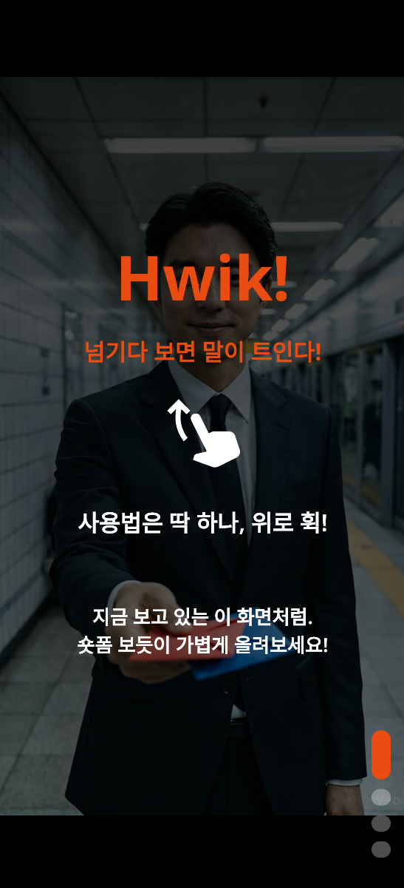
  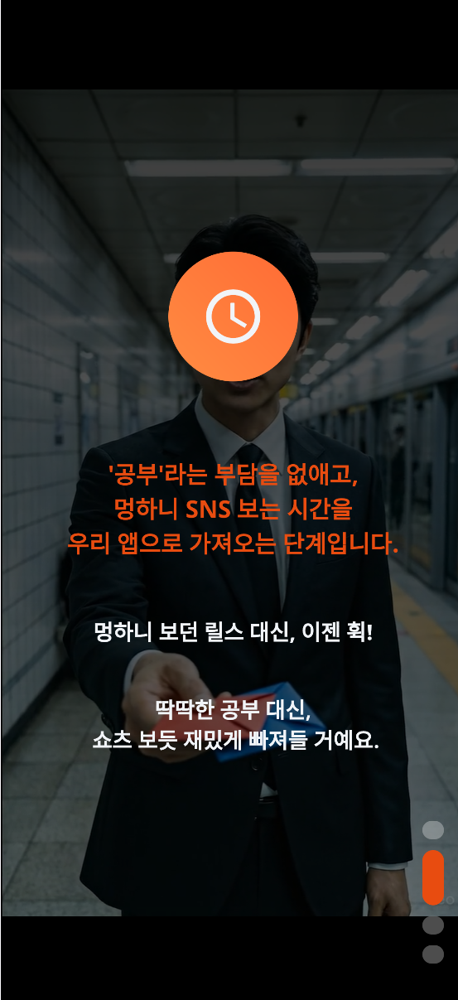
  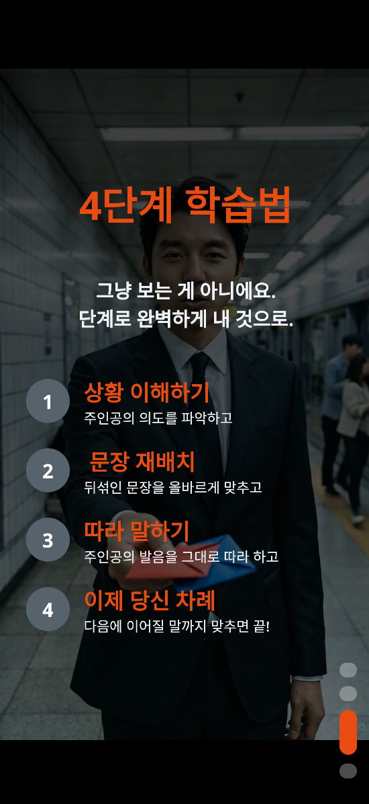
  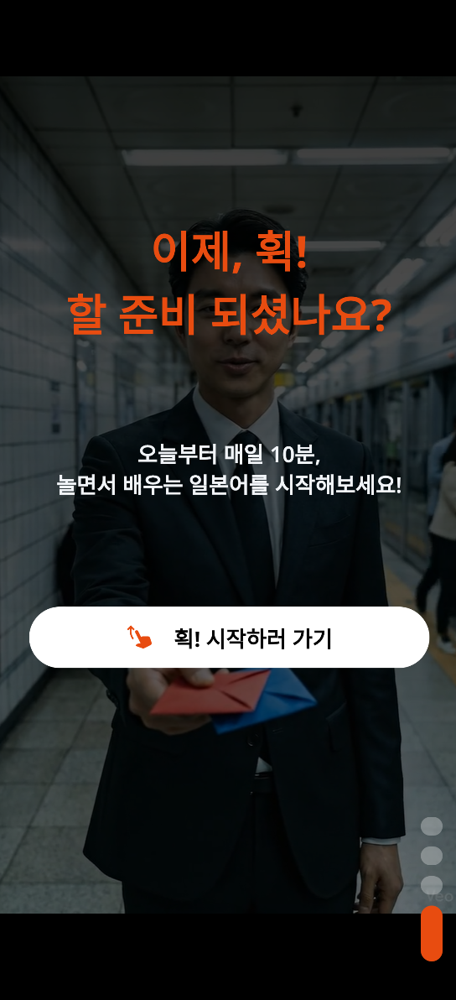
  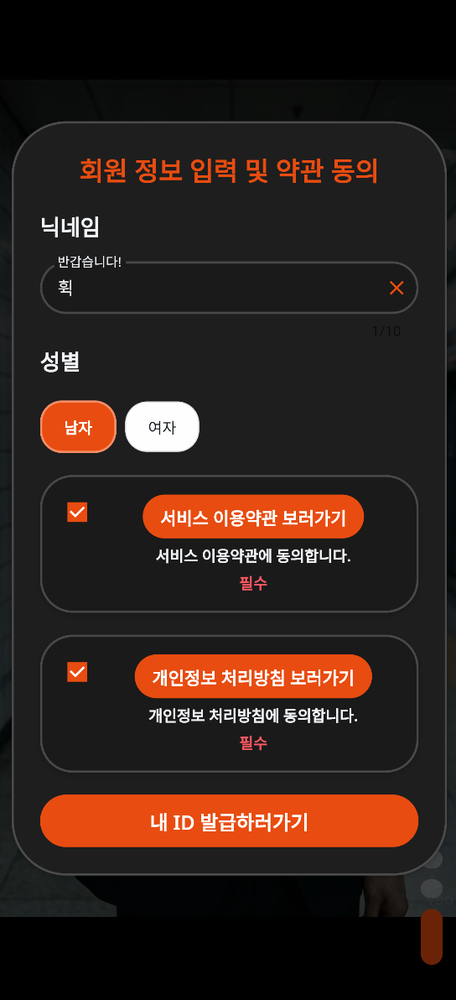
    
  
사용자가 앱의 핵심 가치를 이해하고 자연스럽게 가입으로 이어지도록 설계된 온보딩 플로우입니다.

<b>🔍 2. 탐색 및 테마 </b>

   
  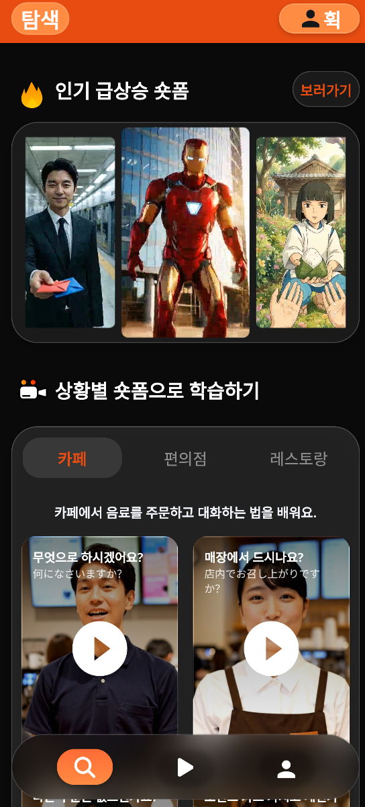
  
    
  
원하는 숏폼 콘텐츠를 쉽게 찾고, 다양한 테마별로 모아볼 수 있는 탐색 기능입니다.

<b>📚 3. 메인 학습 플로우 </b>

   
  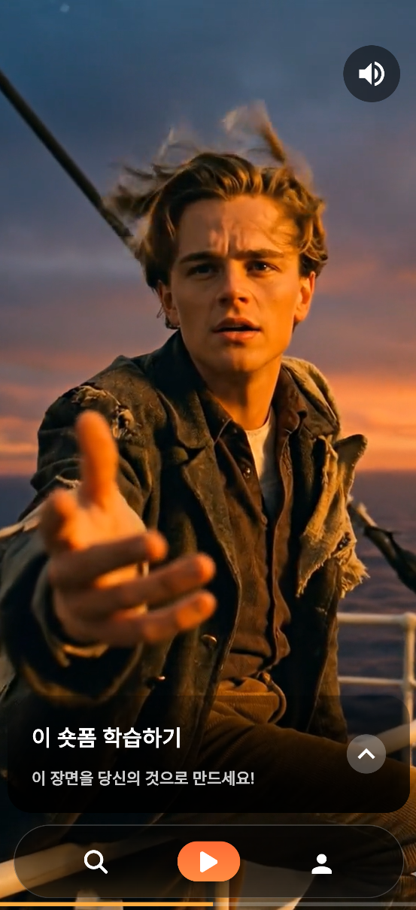
  
  
  
  
    
  
숏폼 시청에서 시작하여 4단계 PPP 순환 학습으로 이어지는 핵심 학습 경험입니다.

<b>⚙️ 4. 프로필 및 설정 </b>

   
  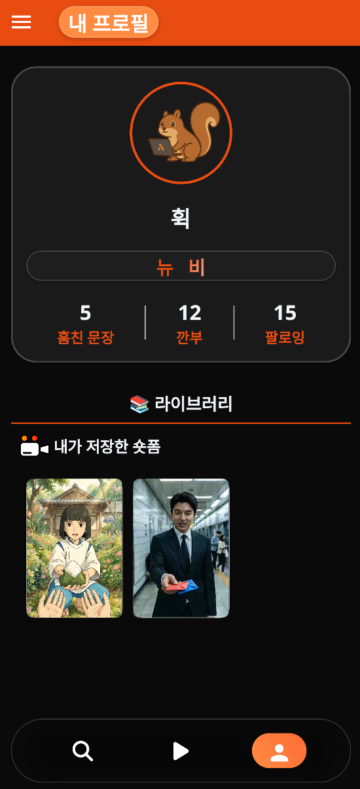
  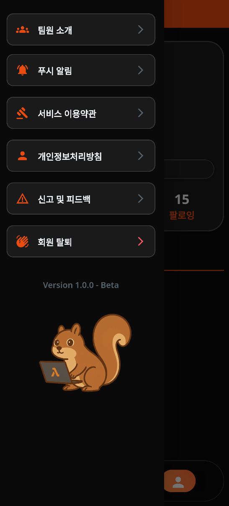
  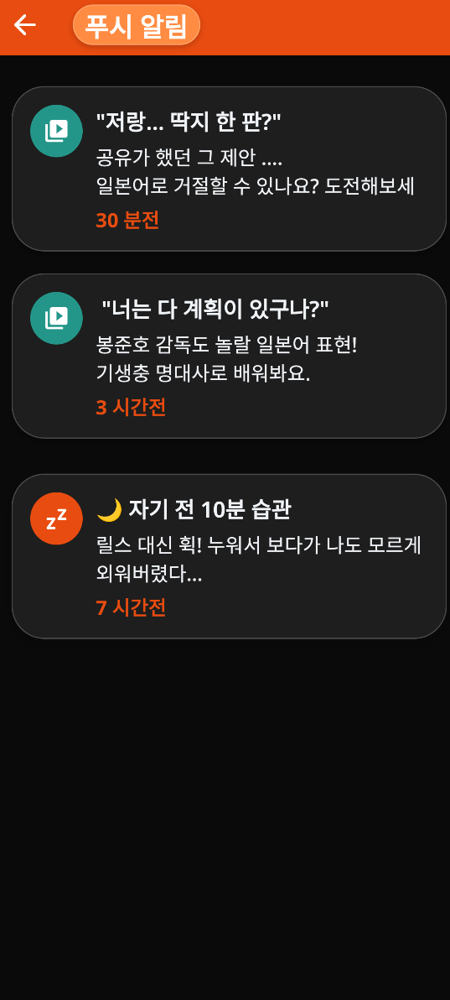
   
  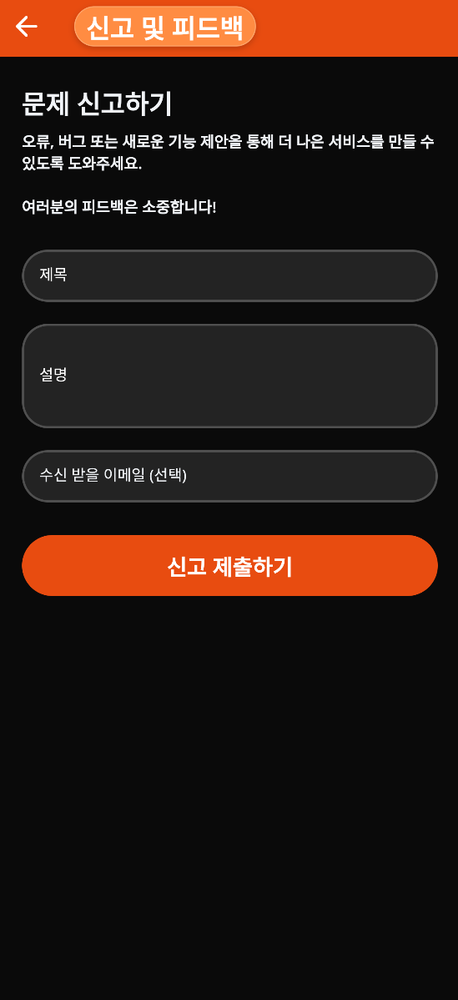
  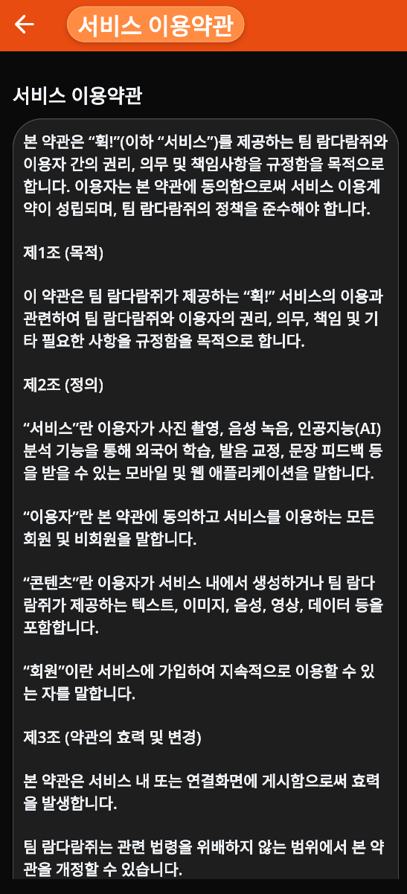
  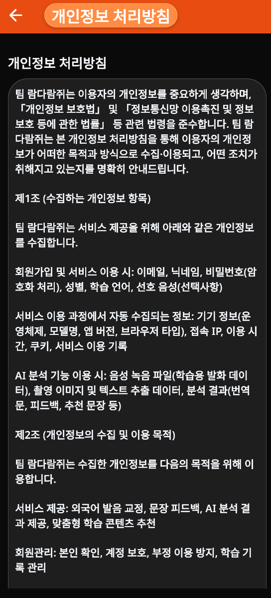
  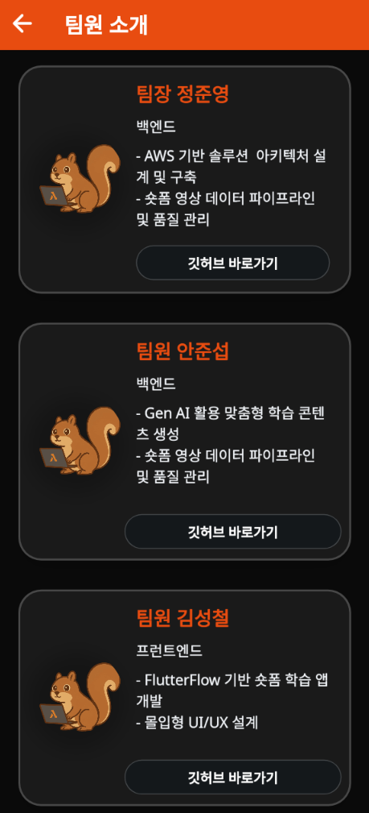
    
  
개인 학습 현황 관리 및 앱 사용 환경을 설정할 수 있는 메뉴들입니다.

 

