<div align="center">

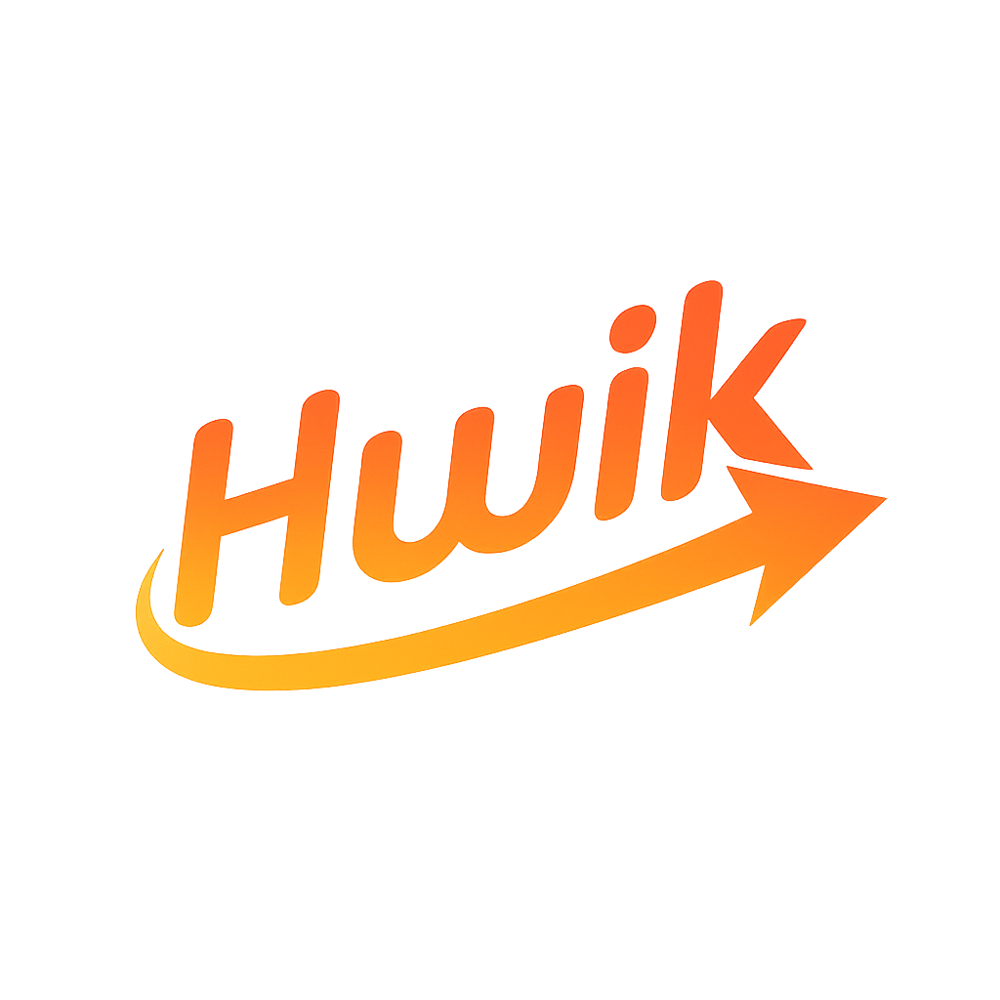

# 휙! (Hwik!)

**숏폼을 넘기다 보면 말이 트인다**

> 짧은 영상으로 듣기 → 말하기 → 피드백까지 한 번에 학습하는 AI 외국어 스피킹 서비스


</div>

---

## 🏆 수상

| 대회 | 수상 |
|------|------|
| 2025 DATA VENTURE 문제 해결 챌린지 (위버스 브레인) | 🥇 대상 |
| 2025 CO-SHOW 빅데이터 컨소시엄 | 🏆 부산광역시장상 |

> 서울대학교 빅데이터 혁신융합대학 × AWS Korea 공동 주관  
> 2025.11.26 ~ 11.29 부산 BEXCO 최종 발표

---

## ⚡ 프로젝트 한눈에 보기

> **"지루한 외국어 학습을, 숏폼의 중독성과 결합하다"**

| 구분 | 내용 |
|------|------|
| **아키텍처** | EC2 없는 100% Serverless — Lambda + API Gateway 기반 백엔드 |
| **비동기 처리** | SQS · EventBridge · DynamoDB Stream을 활용한 완전 이벤트 드리븐 설계 |
| **GenAI 파이프라인** | AWS Bedrock(Claude, Nova Pro) + Google Veo 3 기반 콘텐츠 자동 생성 공장(Factory) 구축 |

**📈 수치로 보는 성과**

- 🎬 **영상 로딩 속도** — CloudFront 도입으로 `6.5s → 0.4s` 단축 (약 **15배** 개선)
- 🏭 **콘텐츠 생산** — Step Functions 기반 영상 100개 동시 생성 파이프라인 자동화

---

## 📌 목차

1. [프로젝트 한눈에 보기](#-프로젝트-한눈에-보기)
2. [프로젝트 배경](#1-프로젝트-배경)
3. [서비스 소개](#2-서비스-소개)
4. [학습 방법 — 4단계 PPP Flow](#3-학습-방법--4단계-ppp-flow)
5. [시스템 아키텍처](#4-시스템-아키텍처)
6. [기술 스택](#5-기술-스택)
7. [나의 역할 — Frontend](#6-나의-역할--frontend)
8. [트러블슈팅](#7-트러블슈팅)
9. [서비스 시연](#8-서비스-시연)
10. [UI 갤러리](#9-ui-갤러리)

---

## 1. 프로젝트 배경 — 여정의 시작

<table>
  <tr>
    <td width="60%" valign="top">
      <h3>1. 도전의 시작: 2025 DATA VENTURE</h3>
      <p>본 프로젝트는 서울대학교 빅데이터 혁신융합대학과 <b>AWS Korea</b>가 공동 주관한 <b>'2025 CO-SHOW 경진대회 데이터 벤처'</b>의 과제에서 시작되었습니다.</p>
      <p>경진대회는 <b>Flex, WeaversBRAIN, ANTLER</b> 세 기업이 제시한 실질적인 비즈니스 과제를 바탕으로 진행되었으며, 저희 팀은 이 중 <b>'WeaversBRAIN'</b> 기업의 미션에 도전하기로 결정했습니다.</p>
    </td>
    <td width="40%" align="center">
      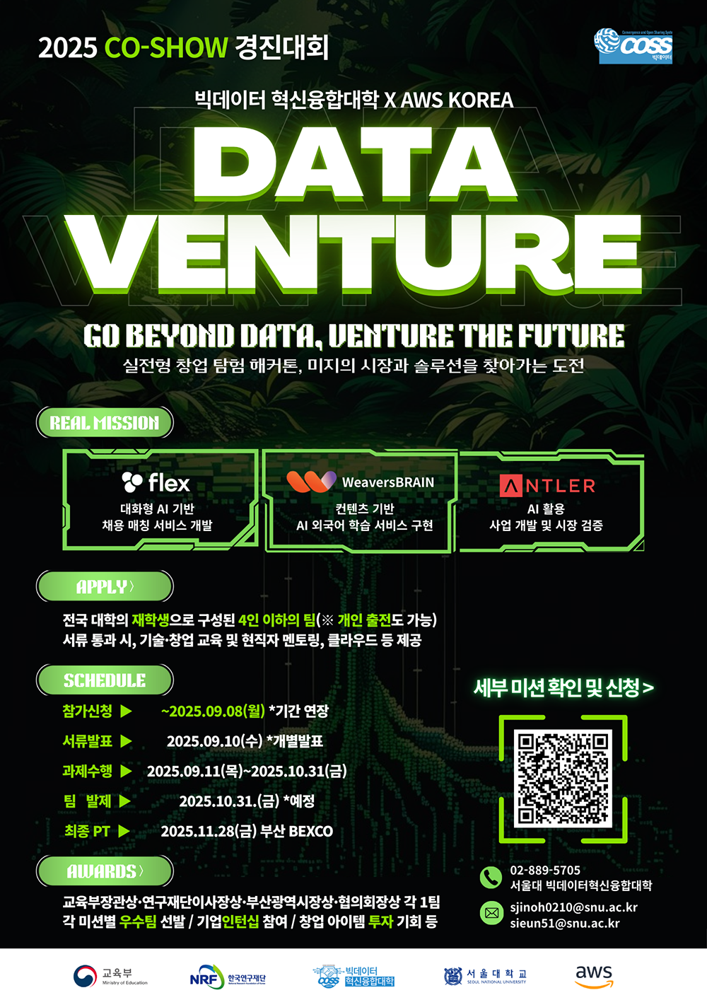
    </td>
  </tr>
  <tr>
    <td width="60%" valign="top">
      <br>
      <h3>2. 핵심 목표: 컨텐츠 기반 AI 학습 구현</h3>
      <p>저희 팀이 선택한 <b>위버스 브레인(WeaversBRAIN)</b>의 미션은 다음과 같았습니다.</p>
      <blockquote>
        <b>💡 주요 주제: 컨텐츠 기반 AI 외국어 학습 서비스 구현</b><br>
        외국어 회화 콘텐츠 기반의 학습 경험을 설계하고, <b>AI 기반의 창의적 피드백</b>을 제공하는 혁신적인 서비스 모델을 구축하는 것을 목표로 삼았습니다.
      </blockquote>
    </td>
    <td width="40%" align="center">
      <br>
      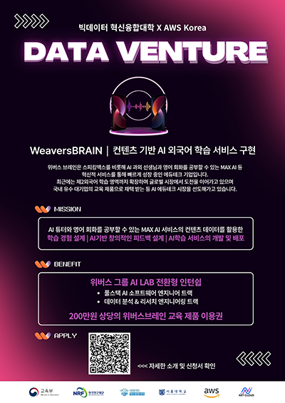
    </td>
  </tr>
  <tr>
    <td width="60%" valign="top">
      <br>
      <h3>3. 최종 검증: 2025 CO-SHOW 발표 및 수상</h3>
      <p>아이디어 구상과 약 두 달간의 집중 개발을 거쳐, 10월 31일 중간 발표를 성공적으로 통과하며 <b>최종 발표 자격</b>을 획득했습니다.</p>
      <p>11월 26일 ~ 29일 부산 BEXCO에서 개최된 <b>'2025 CO-SHOW'</b> 무대에서 최종 결과물을 선보였으며, 서비스의 가능성과 기술적 완성도를 인정받아 <b>두 가지 수상</b>을 달성했습니다.</p>
      <blockquote>
        <b>🏆 수상 결과</b>
        <ul>
          <li><b>2025 DATA VENTURE (위버스브레인 과제):</b> 대상 🥇</li>
          <li><b>2025 CO-SHOW 빅데이터 컨소시엄:</b> 부산광역시장상 🏅</li>
        </ul>
      </blockquote>
    </td>
    <td width="40%" align="center">
      <br>
      
    </td>
  </tr>
</table>

이러한 **치열한 경쟁과 검증 과정**을 통해 탄생한 결과물이 바로, 여러분의 외국어 학습을 혁신할 **'휙!'** 입니다.

<br>

### 📅 개발 여정 (2025.09 ~ 2025.11, 약 3개월)

아이디어 초안부터 부산 벡스코 최종 무대까지, 약 3개월간의 스프린트를 기록했습니다.

| 기간 | 단계 | 주요 내용 |
|------|------|-----------|
| 09.16 – 09.17 | 💡 **아이디어** | 경진대회 예선 초안 제작 및 예선 통과 |
| 09.18 – 09.22 | 📋 **기획** | 52명 대상 사용자 설문 조사, 요구사항 정의 및 MVP 범위 확정 |
| 09.23 – 09.30 | 🏗 **설계** | 시스템 아키텍처 설계, UI/UX 와이어프레임 작성 |
| 10.01 – 10.30 | 🔨 **1차 개발** | 서버리스 백엔드 구축, 4단계 학습 로직 구현, 학습용 영상 콘텐츠 직접 제작 |
| 10.31 | 🎤 **중간 발표** | 결승 진출 확정 |
| 11.01 – 11.27 | 🚀 **2차 개발** | GenAI 영상 생성 파이프라인 자동화 구축, 크로스 플랫폼 디버깅, 시연 준비 |
| 11.28 | 🏆 **최종 발표** | 부산 BEXCO CO-SHOW 무대 — 대상 · 부산광역시장상 수상 |

---

## 2. 서비스 소개

공부라는 심리적 장벽을 없애기 위해 **숏폼 UI**를 차용하고,
에듀테크 관점에서 몰입감 높은 시나리오 콘텐츠를 직접 제작하여 학습 지속성을 확보했습니다.

- 숏폼 기반 4단계 순환 학습 구조
- AI 발음 분석 및 즉각적 피드백
- 학습 이력 관리 및 복습 기능

> 📋 서비스 기획 배경이 된 사용자 설문 분석 및 요구사항 정의 → [REQUIREMENTS.md](./REQUIREMENTS.md)

---

## 3. 학습 방법 — 4단계 PPP Flow

검증된 언어 학습 이론 **PPP (Presentation - Practice - Production)** 을 숏폼 환경에 최적화하여 설계했습니다.

<table width="100%">
  <thead>
    <tr>
      <th width="50%" align="center">Step 1. 상황 이해하기 (Context)</th>
      <th width="50%" align="center">Step 2. 문장 재배치 (Structure)</th>
    </tr>
  </thead>
  <tbody>
    <tr>
      <td align="center" valign="top">
        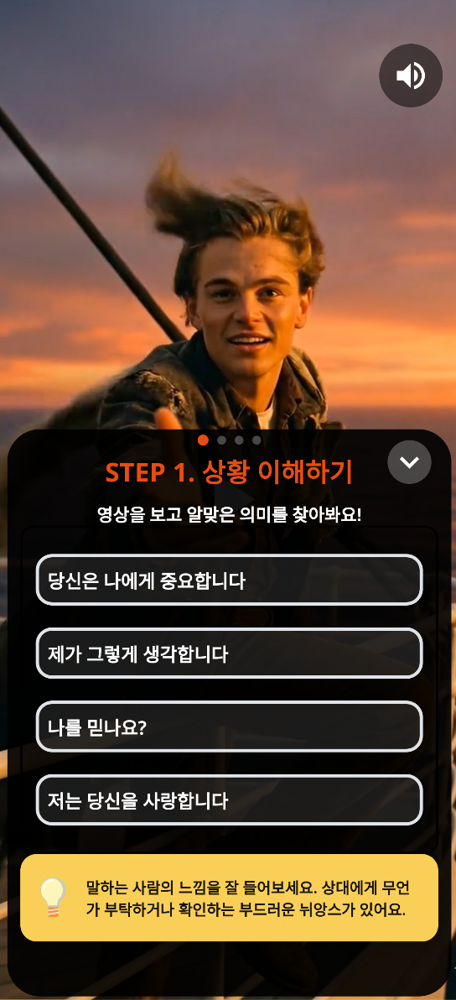
        <br><br>
        <b>"영상 속 주인공이 되어 상황에 몰입합니다."</b><br>
        <span>살아있는 <b>맥락(Context)</b> 속에서 핵심 표현과 뉘앙스를 자연스럽게 파악합니다.</span>
      </td>
      <td align="center" valign="top">
        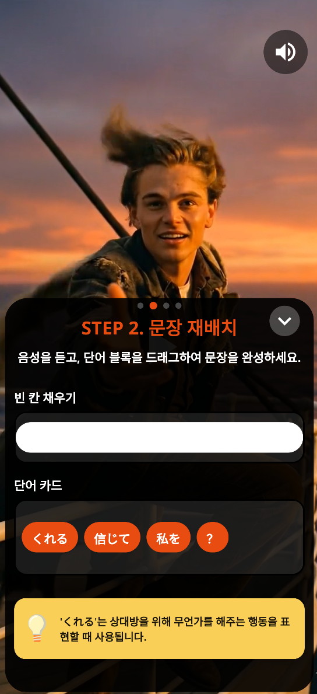
        <br><br>
        <b>"흩어진 문장을 재배열하며 구조를 익힙니다."</b><br>
        <span>단어 블록을 조립하며 문장의 <b>구조적 원리</b>를 게임을 하듯 능동적으로 체득합니다.</span>
      </td>
    </tr>
  </tbody>
</table>

<table width="100%">
  <thead>
    <tr>
      <th width="50%" align="center">Step 3. 따라 말하기 (Shadowing)</th>
      <th width="50%" align="center">Step 4. 이제 당신 차례 (Role-Play)</th>
    </tr>
  </thead>
  <tbody>
    <tr>
      <td align="center" valign="top">
        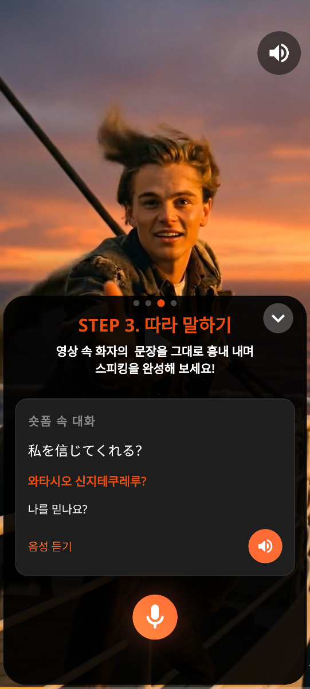
        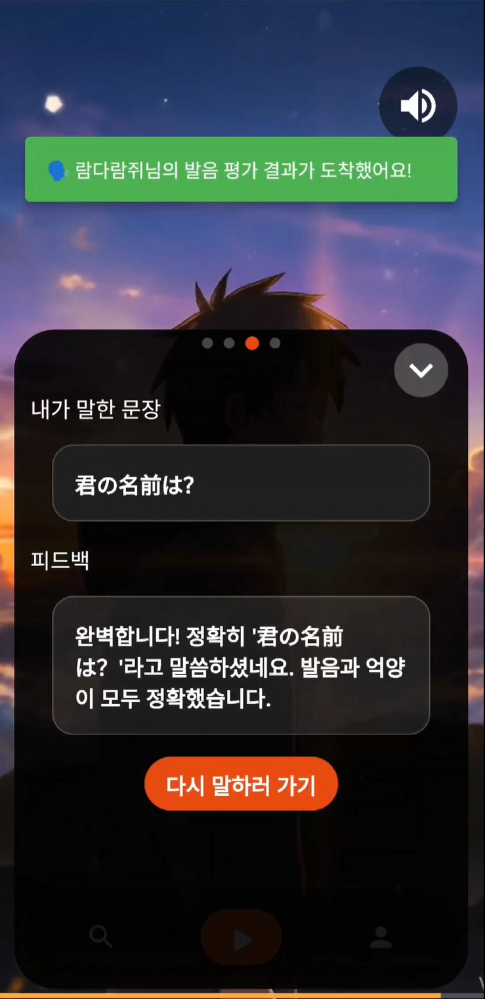
        <br><br>
        <b>"주인공의 억양과 발음을 그대로 훔칩니다."</b><br>
        <span>AI가 사용자의 발음을 분석하여 <b>정확도(Accuracy)</b>와 <b>억양</b>을 즉시 피드백합니다.</span>
      </td>
      <td align="center" valign="top">
        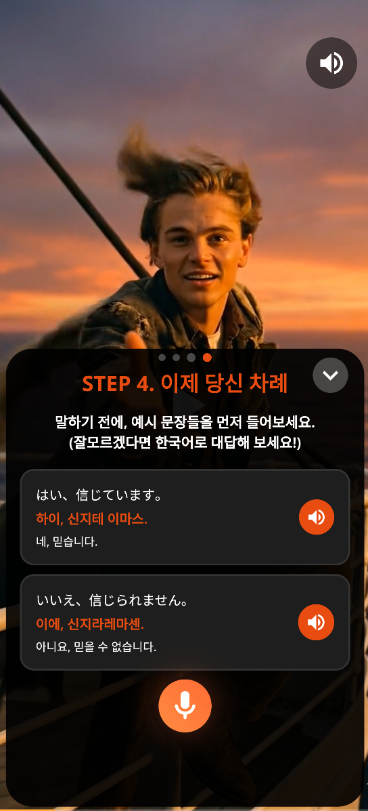
        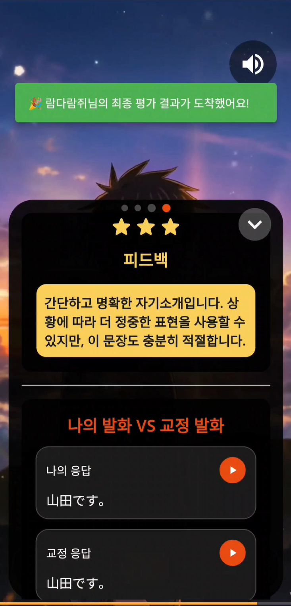
        <br><br>
        <b>"다음 대사를 상상하여 대화를 완성합니다."</b><br>
        <span>상호작용하는 <b>프리 토킹</b>을 통해 실전 회화 감각을 극대화하며, 발화 이후 피드백으로 더욱 완성도 높은 표현력을 갖춥니다.</span>
      </td>
    </tr>
  </tbody>
</table>

---

## 4. 시스템 아키텍처

<p align="center">
  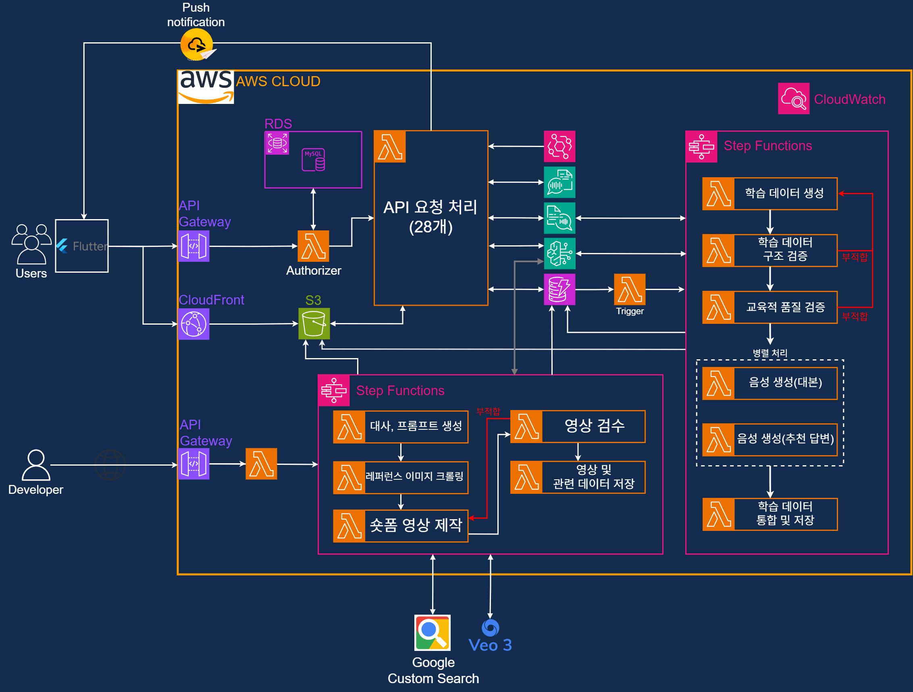
</p>

### 주요 설계 전략

**① Full Serverless Backend (Lambda + API Gateway)**

AWS Lambda는 **FaaS(Function as a Service)** 모델을 기반으로 동작합니다.  
개발자는 서버 프로비저닝·패치·운영 없이 비즈니스 로직 구현에만 집중할 수 있으며, 실행 환경은 플랫폼이 완전히 관리합니다.

| 장점 | 내용 |
|------|------|
| **서버 관리 부담 없음** | OS 패치, 서버 용량 계획, 인프라 운영을 플랫폼이 전담 |
| **자동 확장 (Concurrency 기반)** | 요청마다 독립된 실행 환경이 병렬로 생성됨. 동시 요청 100개 → 실행 환경 100개가 각각 처리 — 인스턴스 추가·설정 없이 자동 대응 |
| **사용한 만큼만 비용 지불** | 함수가 실행된 시간과 횟수에 대해서만 과금. 요청이 없으면 비용 없음 |

- **Lambda + API Gateway** 조합으로 총 **28개 API Endpoint** 를 마이크로서비스 단위로 분리 구현
- 특정 기능 트래픽 급증 시에도 해당 함수만 독립적으로 스케일링되어 전체 서비스 안정성 확보

---

**② Gen-AI 영상 자동 생성 파이프라인 (Step Functions)**

고품질 영상(Veo3) 생성에 5분 이상 소요되는 문제를 해결하기 위해, **AWS Step Functions + SQS 기반의 완전 비동기 파이프라인**을 설계했습니다.

> **핵심 문제:** 동기 처리 시 API 타임아웃(Lambda 최대 15분) 및 UX 저하 발생  
> **해결 전략:** "요청 즉시 202 반환 → 영상 생성은 비동기로 분리" 패턴 적용

<p align="center">
  
</p>

**파이프라인 단계별 설명**

| 단계 | Lambda | 역할 | 핵심 기술 |
|------|--------|------|-----------|
| **L1** | API Gateway | 요청 즉시 `202 Accepted` 반환 — 클라이언트 대기 0초 | API Gateway |
| **L2** | GenScript | 미디어 타입에 맞는 대본, 대사, 영상 프롬프트 생성 | Claude 3.5 Sonnet (Bedrock) |
| **L3** | ImageCrawling | 레퍼런스 이미지 5개 수집 후 텍스트 기반 최적 이미지 1개 선택 | Google Custom Search API |
| **L4** | GenVideo | 이미지 + 프롬프트로 영상 생성 요청 후 **작업 ID만 SQS에 발행하고 즉시 종료** | Google Veo3, SQS |
| **Wait** | — | Step Functions 상태 정지 — Lambda 미실행으로 비용 효율 확보 | SQS polling (EventBridge) |
| **L5** | Video Inspection | 음성 대사·이미지·저작권 기준 GenAI 품질 스코어링 — **기준 미달 시 L2 자동 회귀** | Claude (Bedrock) |
| **L6** | Save | 최종 영상을 S3로 이관, DB 상태 업데이트, 사용자 알림 전송 | S3, DynamoDB |
| **Streams** | — | L6 저장 이벤트로 **학습 데이터 자동 생성** 파이프라인 트리거 | DynamoDB Streams |

<details>
<summary><b>비동기 처리의 핵심 — Wait 상태와 SQS Polling 패턴</b></summary>
<br>

Lambda가 영상 완료를 직접 기다리면 15분 타임아웃 제약에 걸리고, 그 시간 동안 비용도 계속 발생합니다. 이를 해결하기 위해 **`.waitForTaskToken`** 패턴을 적용했습니다.

```
L4 Lambda 종료 (Veo3 작업 ID + taskToken → SQS 저장)
        ↓
Step Functions WAIT  ←  실행 중인 코드 없음, Lambda 비용 없음
        ↓
EventBridge (30초 주기) → 폴러 Lambda → Veo3 API 완료 여부 확인
        ↓ 완료 감지
SendTaskSuccess(taskToken) → Step Functions 재개 → L5 실행
```

- **Google Veo3는 AWS를 모름** — 구글이 직접 콜백을 보내는 것이 아니라, AWS 폴러 Lambda가 주기적으로 구글 API를 조회하고 완료 시 `SendTaskSuccess`를 직접 호출
- **SQS 메시지 구조:** `{ operationId: "veo-op-abc123", taskToken: "AAAAKg..." }` — 폴러가 두 값을 꺼내 구글 조회 후 Step Functions 재개에 사용
- **Map 상태로 최대 100개 동시 처리** — 영상 N개가 각각 독립된 이터레이터로 L3 ~ L6를 병렬 실행

</details>

---

**③ 사용자 음성 학습 파이프라인 (Step 3·4)**

사용자가 음성을 녹음하면 **비동기 처리**로 STT → 언어별 AI 피드백 → TTS → 학습 기록 저장까지 자동으로 처리됩니다.

> **핵심 설계:** 클라이언트는 요청 즉시 jobId를 받고, `get-learning-task` Lambda polling으로 완료를 감지 (202 처리 중 → 200 완료)

<p align="center">
  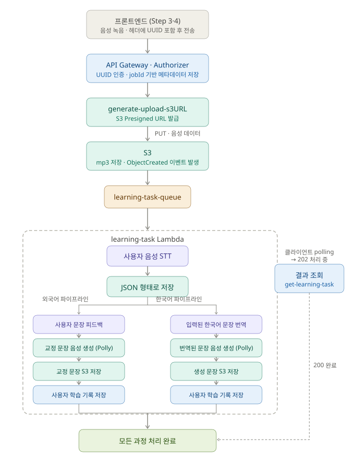
</p>

**파이프라인 단계별 설명**

| 단계 | 구성 요소 | 역할 |
|------|-----------|------|
| **음성 업로드** | API GW Authorizer | 헤더 UUID로 사용자 인증, jobId 기반 메타데이터 저장 |
| **Presigned URL** | generate-upload-s3URL Lambda | 클라이언트가 서버를 거치지 않고 S3에 직접 PUT |
| **이벤트 트리거** | S3 → SQS → Lambda | mp3 저장 시 ObjectCreated 이벤트 → SQS → learning-task 트리거 |
| **STT** | AWS Transcribe | 사용자 음성 텍스트 변환 · lang 값 판별 |
| **외국어 분기** | Claude (Bedrock) + Polly | 문장 피드백 → 교정 음성 생성 → S3 저장 |
| **한국어 분기** | AWS Translate + Polly | 한국어 → 타겟 언어 번역 → 번역 음성 생성 → S3 저장 |
| **기록 저장** | DynamoDB / RDS | 양쪽 파이프라인 공통으로 사용자 학습 이력 저장 |
| **결과 반환** | get-learning-task Lambda | 클라이언트 polling → 완료 시 200 + 결과 데이터 반환 |

**④ AI 서비스 통합**
- **AWS Bedrock (Claude)** — 사용자 발화 교정 및 자연어 피드백 생성
- **AWS Polly** — 원어민 수준 TTS로 리스닝 품질 제고
- **AWS Transcribe** — STT 및 발음 정확도 분석
- **AWS Translate** — 한국어 입력 문장의 타겟 언어 번역

**⑤ Global Latency 최적화 (CloudFront)**
- 미국 동부 리전 고정으로 인한 한국 사용자 영상 지연 문제를 **CloudFront CDN** 도입으로 해결
- 정적 리소스를 엣지 로케이션에 캐싱하여 끊김 없는 숏폼 스트리밍 환경 제공

---

## 5. 기술 스택

**Frontend**  


**Backend & Serverless**  


**AI / ML**  


**Infra & Database**  


---

## 6. 나의 역할 — Frontend

> 담당 파트: Flutter 기반 앱 전반의 UI/UX 구현

- **4단계 학습 플로우 UI** 전체 설계 및 구현 (Step 1 ~ Step 4)
- **숏폼 스크롤 뷰** — 세로 스와이프 기반 콘텐츠 탐색 인터페이스 구현
- **발음 분석 결과 화면** — STT 결과와 AI 피드백을 시각화하는 컴포넌트 설계
- **온보딩 플로우** — 사용자가 서비스 핵심 가치를 이해하고 자연스럽게 가입으로 이어지는 UX 설계
- **크로스 플랫폼 대응** — iOS / Android 환경 차이로 인한 미디어 호환성 문제 해결 (→ [트러블슈팅 참고](#7-트러블슈팅))

---

## 7. 트러블슈팅

<details>
<summary><b>① 데이터 흐름 최적화 — API 중복 호출 & 확장성 문제</b></summary>
<br>

**문제**
- 페이지 이동 시마다 API를 재호출하여 불필요한 로딩 지연 발생
- 12개 이상의 콘텐츠를 정적 페이지로 각각 생성 → 콘텐츠 증가 시 유지보수 비용 선형 증가

**해결**
- `Page Parameter` 를 활용한 **Data Passing 패턴** 도입 — API 중복 호출 100% 제거, 즉각적인 페이지 전환 구현
- N개의 콘텐츠를 하나의 동적 템플릿에서 처리하는 **Single Template Architecture** 로 전환
- 데이터 유무(Null Safety)에 따른 **조건부 렌더링** 로직으로 무한 확장 가능한 구조 완성

**결과** — 콘텐츠가 수백 개로 늘어나도 코드 수정 없이 즉시 대응 가능한 확장성 확보

</details>

<details>
<summary><b>② 크로스 플랫폼 미디어 호환성 — iOS / Android 파편화 문제</b></summary>
<br>

**문제**
- Android(Chrome)는 `WEBM_OPUS` 포맷 지원, iOS(WebKit)는 `LINEAR16(WAV)` 만 허용 → 오디오 재생·녹음 오류 발생
- iOS 웹 환경의 기본 Stereo(2ch) 녹음이 STT AI 모델의 Mono(1ch) 입력 요구와 불일치 → 인식률 저하
- iOS Safari의 Autoplay Policy로 숏폼 핵심 기능인 소리 포함 자동 재생 차단

**해결**
- 프론트엔드 단에서 **바이트(Byte) 수준의 오디오 전처리** 구현
  - 오디오 헤더 분석 → iOS 판별 시 비트 연산으로 좌/우 채널 평균값 병합(Downmixing) → Mono PCM16 변환 후 전송
- `User Agent` 분석으로 OS 환경 감지 후 UX 시나리오 분기
  - iOS 사용자에게 "터치하여 소리 켜기" 오버레이 UI 선노출 → 브라우저 정책 준수 + 끊김 없는 미디어 경험 동시 확보

**결과** — OS·브라우저 환경 무관 100% 미디어 호환성 확보, 클라이언트 전처리로 서버 비용 절감 및 STT 인식률 개선

</details>

---

## 8. 서비스 시연

### 영상 시청
<video src="https://github.com/user-attachments/assets/5c3b0f06-adbd-424b-b0d3-da7a0acbb4e4" controls width="300"></video>

### 스텝별 문제풀이
<video src="https://github.com/user-attachments/assets/f6a20327-310e-4ebb-9e26-2483e543d59e" controls width="300"></video>

### 둘러보기
<video src="https://github.com/user-attachments/assets/656a3dd5-40e8-421e-bd69-b3fbce29a5e8" controls width="300"></video>

---

## 9. UI 갤러리

<details>
<summary><b>🚀 온보딩 및 회원가입</b></summary>
<div align="center"><br>
  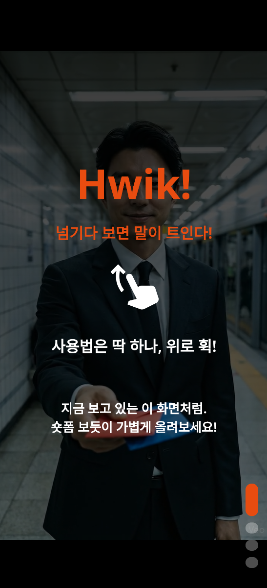
  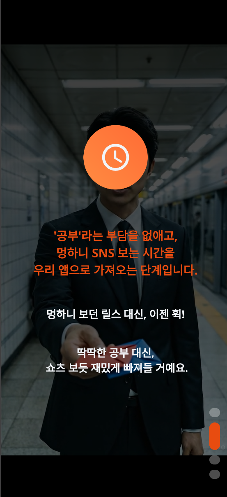
  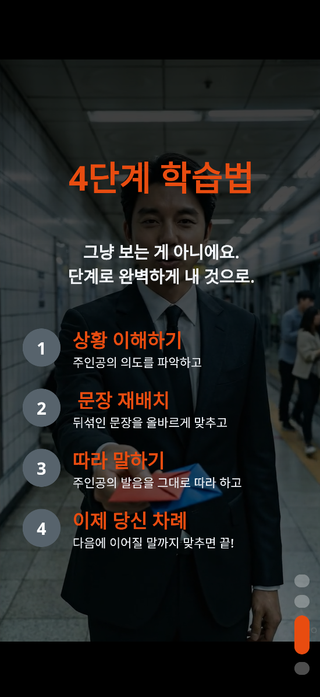
  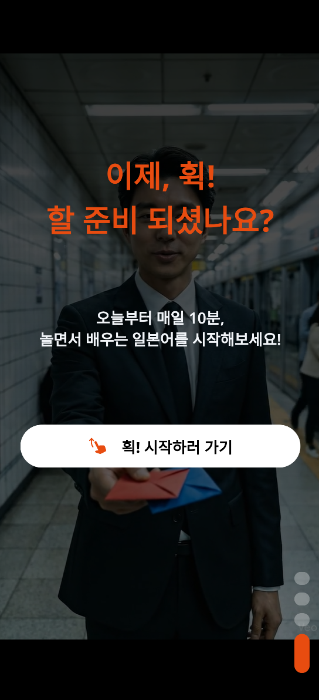
  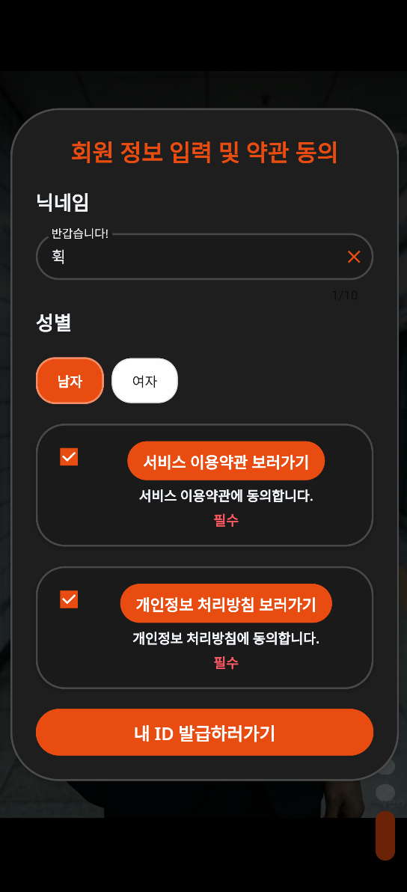
  <p>사용자가 앱의 핵심 가치를 이해하고 자연스럽게 가입으로 이어지도록 설계된 온보딩 플로우</p>
</div>
</details>

<details>
<summary><b>🔍 탐색 및 테마</b></summary>
<div align="center"><br>
  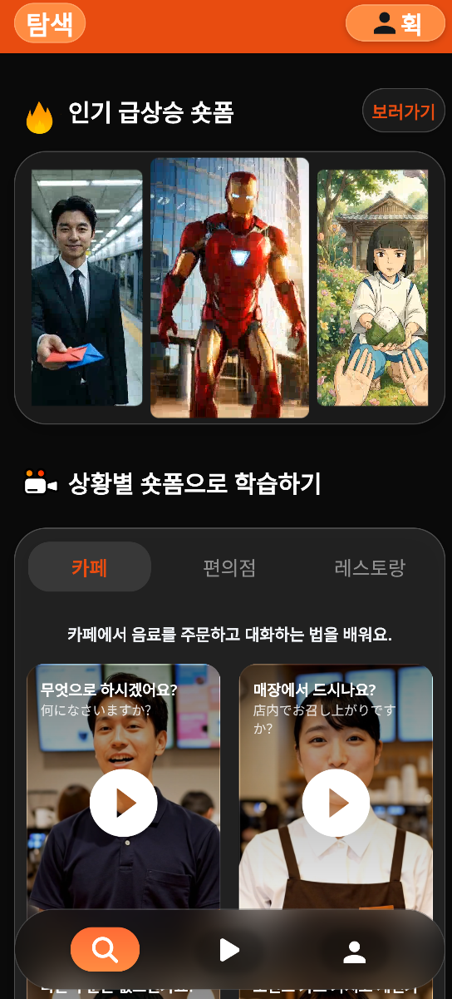
  
  <p>원하는 숏폼 콘텐츠를 쉽게 찾고, 다양한 테마별로 모아볼 수 있는 탐색 기능</p>
</div>
</details>

<details>
<summary><b>📚 메인 학습 플로우</b></summary>
<div align="center"><br>
  
  
  
  
  
  <p>숏폼 시청에서 시작하여 4단계 PPP 순환 학습으로 이어지는 핵심 학습 경험</p>
</div>
</details>

<details>
<summary><b>⚙️ 프로필 및 설정</b></summary>
<div align="center"><br>
  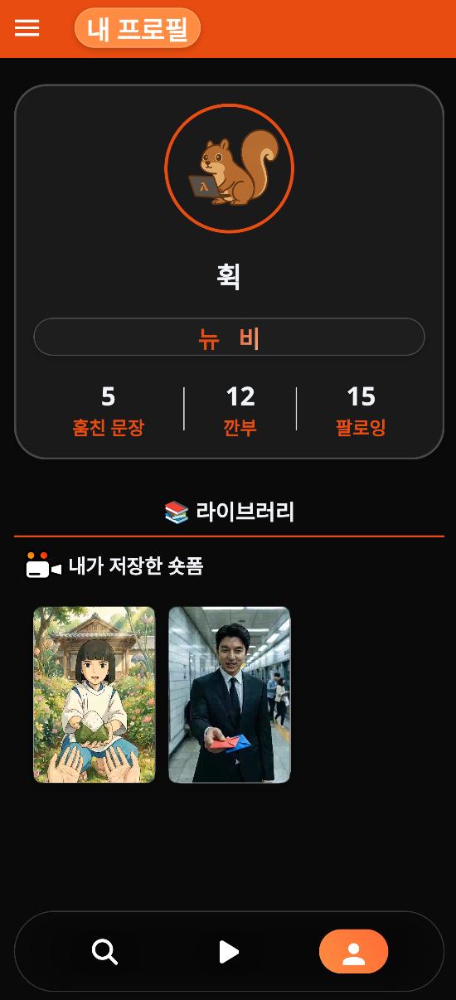
  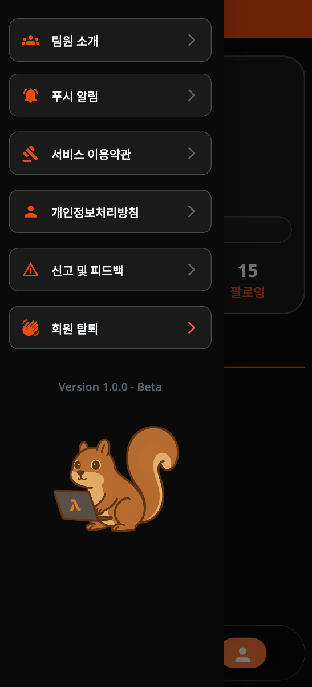
  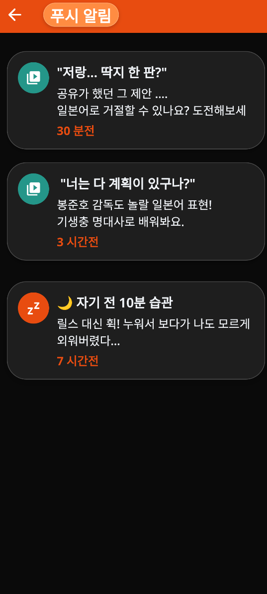
  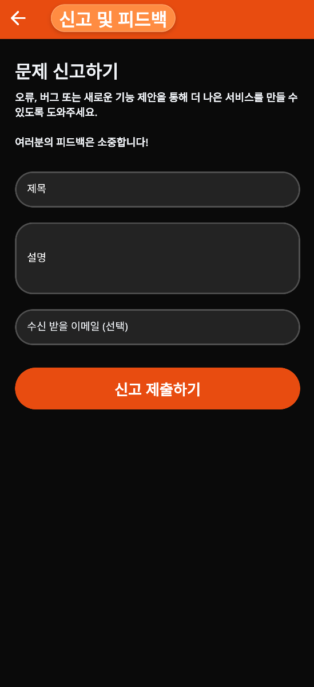
  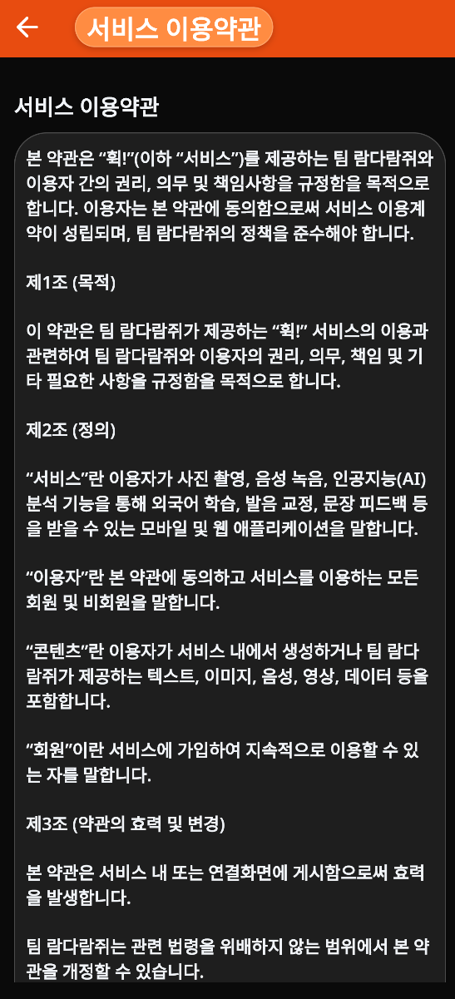
  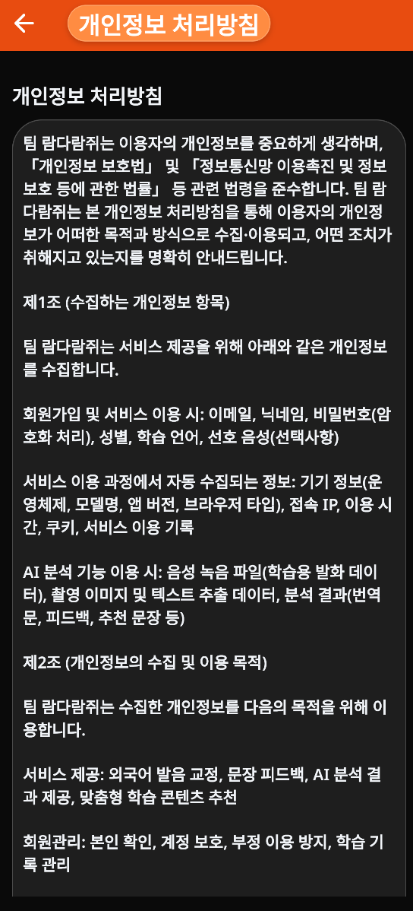
  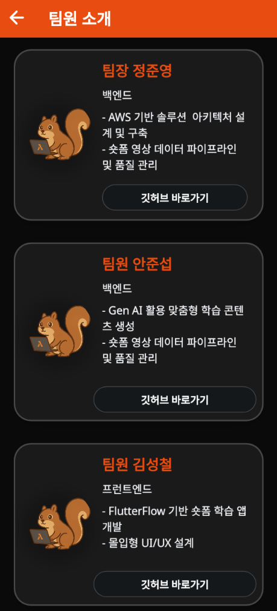
  <p>개인 학습 현황 관리 및 앱 사용 환경 설정</p>
</div>
</details>

---
